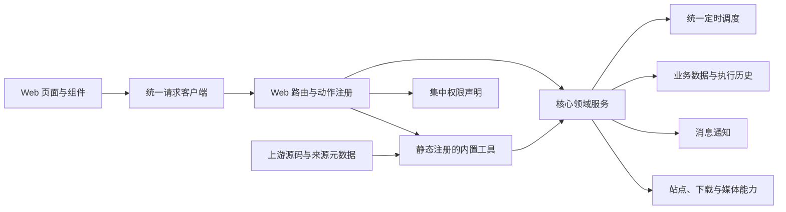

# 重构与功能整合设计

本项目采用渐进式重构：保留现有 Flask/Jinja 和核心自动化链路，先建立稳定边界，再将维护价值明确的能力纳入项目内置模块。

## 目标架构

边界约定：

- 页面只负责交互和展示，不直接拼装跨领域业务流程。
- Web 动作必须声明处理器和权限，未知动作默认拒绝。
- 新能力必须接入本项目的配置、数据库、调度器、通知和权限模型。
- 工具随项目版本静态注册和发布，不在运行时下载、扫描或加载代码。
- 外部插件必须先适配项目边界，并完整记录固定版本的上游来源。
- 只有边界清晰、维护价值明确的功能才进入主程序。

## 当前基线

- `web/permissions.py` 集中声明页面、动作和 API 权限，并通过测试检查动作与路由覆盖。
- `web/static/js/api-client.js` 统一处理请求超时、取消、网络错误、登录失效和进度条清理。
- 备份、上传、目录浏览和新业务页面采用 Flask Blueprint，逐步缩小 `web/main.py`。
- `app/tools/registry.py` 显式登记内置工具及其页面、权限和来源信息。
- `/tools` 按当前用户权限展示工具，`/tools/site-signin` 提供签到页面。
- 站点自动签到作为内置工具运行，统一使用项目的站点、配置、数据库、调度、通知和权限能力。

## 工具模块

`app/tools/` 承载面向用户的内置工具。每个工具拥有稳定 ID 和独立业务目录，静态注册表为 `/tools` 聚合页提供页面、权限和展示信息；调度任务、Web 动作及其他运行入口仍由宿主显式接入。`app/utils/` 只放无独立页面和业务状态的通用代码，两者职责不同。

### 注册约定

`ToolDefinition` 记录工具 ID、名称、描述、页面、权限、图标和顺序。项目原生工具可以不声明外部来源；从其他项目适配的工具必须通过 `ToolSource` 记录以下信息：

- `repository`：上游仓库地址；
- `path`：仓库内原始源码路径；
- `revision`：引入时固定的 tag 或 commit；
- `author`：原作者或维护者；
- `license`：上游许可证标识。

工具注册采用显式 import 和静态清单。注册表不负责统一加载或管理工具生命周期，也不下载源码、安装依赖、扫描目录、动态导入或热加载；工具依赖随项目锁文件和镜像一起交付。

### 外部适配

MoviePilot 插件只能作为上游实现参考和待适配源码。引入时需要把插件使用的配置、数据、调度、通知、事件、API 和页面接缝转换为本项目现有能力，再将结果注册为内置工具。MoviePilot 的插件市场、动态安装器、`_PluginBase` 生命周期、Vuetify JSON 页面、Vue 联邦组件和动态 FastAPI 路由不属于本项目运行时契约。

## 自动签到

站点自动签到位于 `app/tools/site_signin/`。工具负责配置、执行编排和状态展示，`app/sites/` 继续负责站点身份、连接信息与 Cookie；数据库历史、统一调度和通知渠道由宿主提供，页面入口为 `/tools/site-signin`。

当前内置能力：

- 按站点选择签到或保号登录；
- 固定时间、时间范围随机执行或按小时间隔执行；
- 同一天成功任务自动跳过；
- 失败结果按正则关键词重试；
- 并发数量限制，浏览器仿真自动串行；
- 执行结果持久化、今日状态和最近历史展示；
- 手动执行待签任务或强制全部重跑；
- 复用现有 Cookie、User-Agent、代理、浏览器仿真和通知渠道。

> 站点规则和页面可能变化，签到成功也不必然等同于站点认定的用户活跃。使用前应确认站点规则，并避免过高频率访问。

## 分阶段实施

### 领域拆分

将 `web/action.py` 按搜索、下载、站点和系统设置拆成领域服务；动作注册项包含处理器、权限、输入校验和响应模型。`web/main.py` 按页面蓝图拆分并保留现有 URL。

### Web 组件化

保留服务端渲染外壳，逐页移除内联 `onclick`、重复 Ajax 和字符串拼接 HTML。公共状态统一为加载、空、成功、失败和无权限；长任务返回任务状态并由页面轮询更新。

### 工具演进

后续从 MoviePilot 或其他项目选择能力时，按以下顺序评估：

1. 是否能复用现有领域服务；
2. 是否有明确配置、权限、错误和数据边界；
3. 上游 revision、作者、许可证和依赖是否可审计；
4. 是否会修改核心数据或引入不必要的运行时风险；
5. 是否能够独立验证、升级和回滚。

优先整合消息增强、维护任务、元数据扩展和站点辅助功能。核心搜索、媒体识别、下载目录匹配和下载管理继续保留在主程序，不通过工具覆盖核心实现。

## 质量门槛

- 新增 Web 动作必须同步进入权限覆盖检查。
- 工具 ID 必须唯一；外部来源工具必须填写完整来源元数据并固定 revision。
- 配置和上传接口必须在服务端执行权限与输入校验。
- 网络错误必须区分超时、HTTP 状态、Cookie 失效和站点防护，日志不得输出 Cookie。
- 长任务需要防止重复并发执行，并保留可核对的执行结果。
- 每个阶段至少执行 Python 语法检查、模板解析、JavaScript 语法检查、权限覆盖检查和 `git diff --check`。
